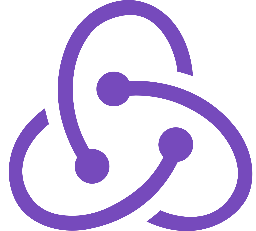

# Olá! Me chamo Jhony Freitas 👦🏻 
 

### Desenvolvedor FullStack.  Bem-vindo(a) ao meu repositório 🖥🚀
Aqui você encontrará alguns dos meus projetos, espero que gostem!!!🖖🏻

#

### Acesse meu portfólio aqui. 👇🏻
[Portfólio - Jhony Freitas](https://portfolio-jhony-freitas.vercel.app/)

#

 

  <a href="https://github.com/jhonyfreitasdev">
  
  

 

 #
 
### 🛠 Skills
 

 
#
 
### 📞 Quer trabalhar comigo ou entrar em contato? Vou deixar minhas redes com você.
 
 

 
 
 
 
  
  

 

 
#
 

 

